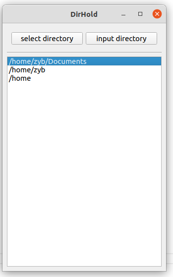

# DirHold

DirHold is a Qt application for caching and managing frequently accessed directories. The directories are listed by usage frequency, and you can open or delete them with ease. This application supports both Windows and Linux platforms.

## Features

- **Add Directory**: 
  - Use "Select Directory" to choose a directory.
  - Use "Input Directory" to enter the path manually.
- **Open Directory**: Double-click an item in the item (left-click) to open the directory.
- **Delete Directory**: Double-click an item in the item (right-click) to delete it from the cache.
- **Persistence**: Directories and their access frequencies are saved to a file for persistence.



## Installation

1. **Clone the repository**:
   ```bash
   git clone https://github.com/hisan/distList.git
   cd DirHold
   cmake .. && make
